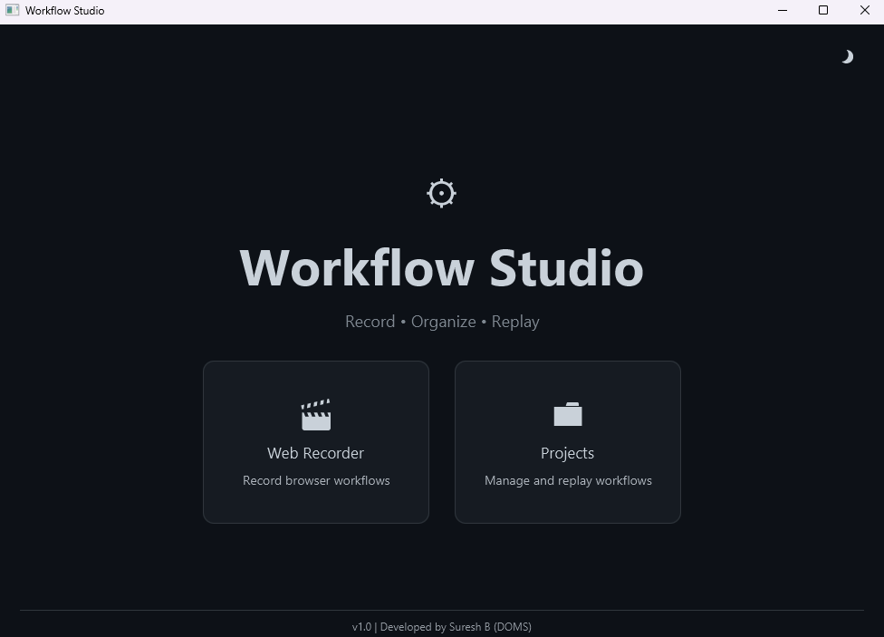
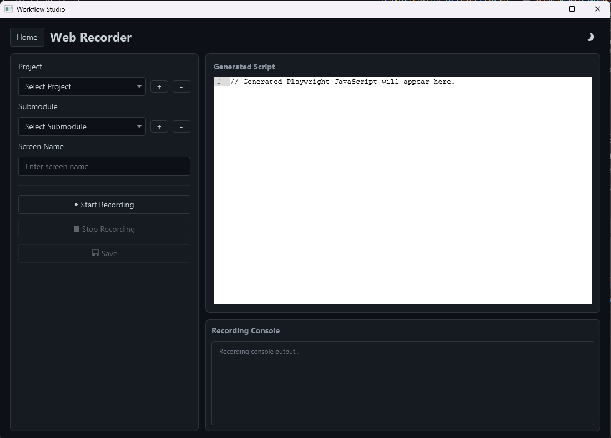
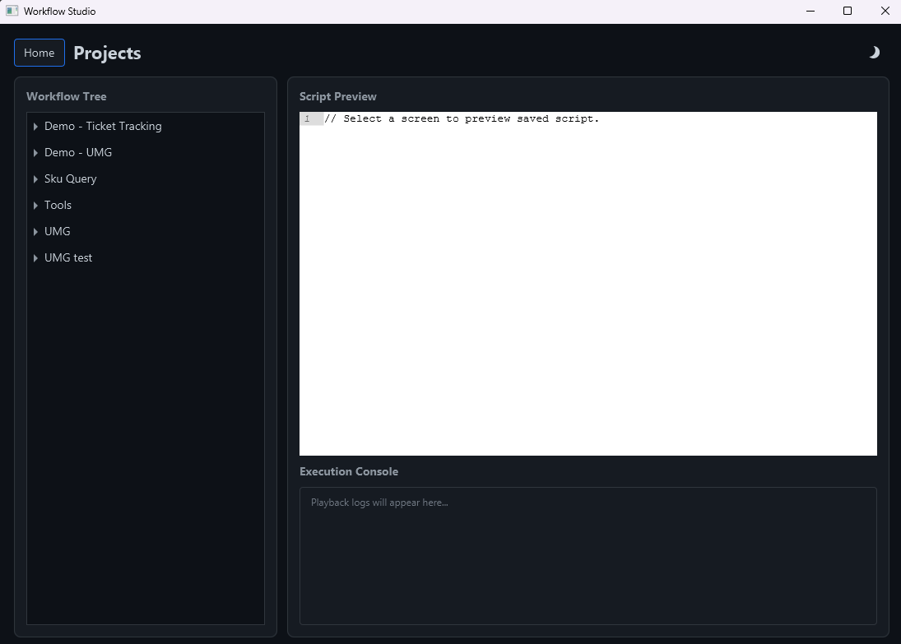

# Workflow Studio

Workflow Studio is a JavaFX desktop app to **record browser workflows with Playwright**, organize them by project/submodule/screen, and replay them from a script catalog.

## What this app does

1. **Record** user actions in a browser using Playwright codegen.
2. **Organize** generated scripts in a project tree (`Project -> Submodule -> Screen`).
3. **Replay** saved scripts from the Projects screen with live execution logs.

---

## Screen-by-screen guide

## 1) Home screen

The Home screen is the entry point.

- **Web Recorder** card opens the recording workspace.
- **Projects** card opens the script management and playback workspace.
- **Theme toggle** (top-right) cycles Dark/Light/System and persists the preference.
- Footer shows app version/author text.

> Purpose: quick navigation between recording new flows and managing existing flows.

## 2) Web Recorder screen

The Web Recorder screen is where new workflows are captured and saved.

### Left panel (workflow metadata + actions)

- **Project** dropdown with `+` and `-` to create/delete projects.
- **Submodule** dropdown with `+` and `-` to create/delete submodules under selected project.
- **Screen Name** text field for the workflow name.
- Action buttons:
  - **Start Recording**: launches Playwright codegen.
  - **Stop Recording**: stops the active recording and loads generated script.
  - **Save**: validates and stores script + metadata.

### Right side

- **Generated Script** panel (read-only code editor with line numbers).
- **Recording Console** panel showing live output from the Playwright recording process.

### Validation and behavior

- Start is blocked if Project/Submodule/Screen is missing.
- Duplicate screen names are prevented.
- Save is enabled only after a successful recording stop with non-empty script output.
- Saved scripts are stored under `scripts/<Project>/<Submodule>/<Screen>.js`.

> Purpose: capture repeatable browser flows and persist them as reusable scripts.

## 3) Projects screen

The Projects screen is for browsing, replaying, previewing, and deleting saved workflows.

### Left panel

- **Workflow Tree** grouped as:
  - Project
  - Submodule
  - Screen
- Clicking a screen node loads that script in preview.

### Right panel

- **Script Preview** (read-only editor with line numbers).
- **Play** button:
  - Executes selected script through Node/Playwright.
  - Streams output/errors to Execution Console.
  - Handles prior active playback process cleanup before starting a new one.
- **Delete** button:
  - Deletes both script file and metadata after confirmation.
- **Execution Console**:
  - Shows start/end info and runtime logs (`[INFO]`, `[OUT]`, `[ERR]`).

> Purpose: run and manage recorded workflows without re-recording.

---

## Screenshots

### Home screen



### Web Recorder screen



### Projects screen



---

## Prerequisites

- **Java 17**
- **Node.js** available on PATH
- **Playwright** available via `npx playwright --version`

Startup validation checks Node and Playwright before opening the app.

### Installing Node.js

- **Windows**: download the LTS installer from [nodejs.org](https://nodejs.org/) and run it, or install via winget:
  ```bash
  winget install OpenJS.NodeJS.LTS
  ```
- **macOS**: 
  ```bash
  brew install node
  ```
- **Linux (Debian/Ubuntu)**:
  ```bash
  curl -fsSL https://deb.nodesource.com/setup_lts.x | sudo -E bash -
  sudo apt-get install -y nodejs
  ```

Verify the install:
```bash
node -v
npm -v
```

### Installing Playwright

Install Playwright globally so it can be resolved by scripts run outside a project folder, then download the browser binaries:
```bash
npm install -g playwright
npx playwright install
```

Verify the install:
```bash
npx playwright --version
```

### Troubleshooting: `Cannot find module 'playwright'`

If script playback fails with `Error: Cannot find module 'playwright'`, it means Node can't resolve the global Playwright install. Find where npm installed it:
```bash
npm root -g
```
Confirm a `playwright` folder exists inside that path, then (on Windows) set a `NODE_PATH` environment variable to that path via System Properties → Environment Variables, or:
```powershell
[Environment]::SetEnvironmentVariable("NODE_PATH", "<path from npm root -g>", "User")
```
Restart the terminal/app afterward so the new environment variable takes effect.

## Run locally

```bash
mvn javafx:run
```

## Build a runnable JAR

```bash
mvn clean package
java -jar target/workflow-studio-1.0.0-SNAPSHOT-all.jar
```

Use the `-all.jar` artifact for launching (it includes the app entrypoint + dependencies).  
For distribution, build on each target OS separately (macOS build for macOS, Windows build for Windows), because JavaFX runtime natives are platform-specific.

## Tech stack

- Java 17
- JavaFX 21
- RichTextFX (code editor component)
- Jackson (JSON persistence)
- SLF4J + Logback

## Data location

By default, app data is stored in:

- Windows: `D:\Workflow Studio` (if `D:` exists), otherwise `%USERPROFILE%\Workflow Studio`
- Or custom path via `WORKFLOW_STUDIO_HOME` environment variable

Inside that root, the app maintains:

- `data/` (project/workflow catalog)
- `scripts/` (saved Playwright scripts)
- `settings/` (theme/settings)
- `logs/` (runtime logs)
